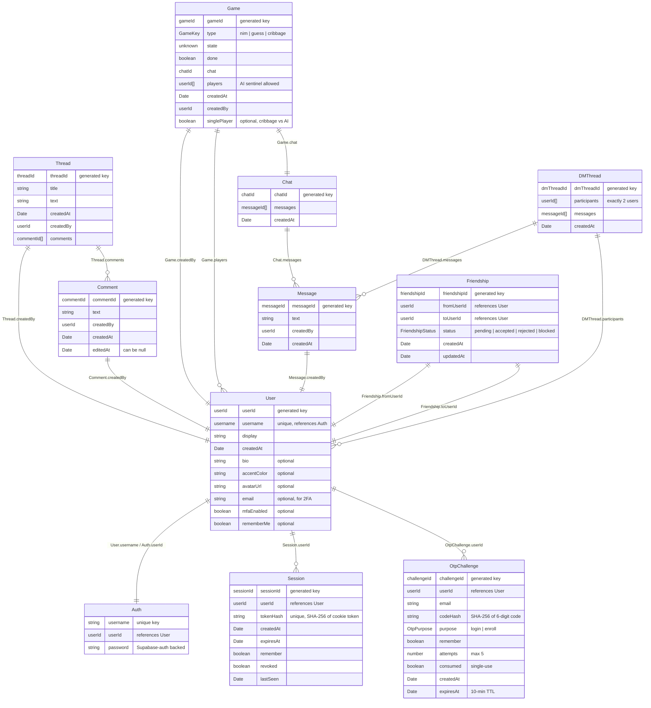

## Getting Started

Run `npm install` in the root directory to install all dependencies for the
`client`, `server`, and `shared` folders.

### Working on the application

While you're working on the application, it's useful to run it in "development
mode" locally. Development mode watches files for changes and updates the
application when changes happen.

To run gamenite locally in development mode, do one of the following:

1. Run `npm run dev` in the top-level directory
2. Open two terminal windows
   - In the first, navigate to the `server` directory and run `npm run dev`
   - In the second, navigate to the `client` directory and also run
     `npm run dev`

The second terminal window, the one in the `client` directory, shows a URL
that you should go to to preview the application, probably
<http://localhost:4530/>. You can use the default username/password
combinations user0/pwd0000, user1/pwd1111, user2/pwd2222, and user3/pwd3333 to
log in.

Out of the box the app runs entirely in-memory and requires no external
services: data lives in an in-process store and 2FA codes are logged to the
server console. To run against real infrastructure, configure the optional
environment variables described in
[Persistence, Authentication & Email](#persistence-authentication--email).

### Checking the application

Checks can be run on every part of the application at once by running the
following commands from the repository root:

- `npm run check` - Checks all three projects with TypeScript
- `npm run lint` - Checks all three projects with ESLint
- `npm run test` - Runs Vitest tests on all three projects and end-to-end
  Playwright tests

### Building the application

If you want to deploy the application or build it in production mode, running
`npm run build -w=client` in the root of the repository will create the
production build of the client. Then, the server can be started in production
mode by running `npm start -w=server` and accessed by going to
<http://localhost:8000/>.

## Codebase Folder Structure

- `client`: Contains the frontend application code, responsible for the user
  interface and interacting with the backend. This directory includes all
  React components and related assets.
- `server`: Contains the backend application code, handling the logic, APIs,
  and database interactions. It serves requests from the client and processes
  data accordingly.
- `shared`: Contains all shared type definitions that are used by both the
  client and server. This helps maintain consistency and reduces duplication
  of code between the two folders.

## API Routes

The server provides the following REST endpoints: requests are routed to these
endpoints in `server/src/app.ts`. Routes marked _(session)_ require a valid
session cookie (see [Authentication & Sessions](#authentication--sessions)).

#### `/api/game`

| Endpoint          | Method | Description                                       |
| ----------------- | ------ | ------------------------------------------------- |
| `/create`         | POST   | Create a new game (Nim, Number Guesser, Cribbage) |
| `/invite`         | POST   | Invite a friend to a game                         |
| `/invite/decline` | POST   | Decline a pending game invitation                 |
| `/invite/list`    | GET    | List the caller's pending game invitations        |
| `/list`           | GET    | List all games                                    |
| `/:id`            | GET    | Get information about a specific game             |

#### `/api/thread`

| Endpoint                         | Method | Description                        |
| -------------------------------- | ------ | ---------------------------------- |
| `/create`                        | POST   | Create new forum post              |
| `/list`                          | GET    | List all forum posts               |
| `/:id`                           | GET    | Get information about a forum post |
| `/:id/comment`                   | POST   | Add a comment to a forum post      |
| `/:id/comment/:commentId/delete` | POST   | Delete a comment from a forum post |

#### `/api/user`

| Endpoint               | Method | Description                                              |
| ---------------------- | ------ | -------------------------------------------------------- |
| `/list`                | POST   | Get details of a list of users                           |
| `/login`               | POST   | Validate username/password (may issue a 2FA challenge)   |
| `/login/verify`        | POST   | Complete login by verifying an emailed 2FA code          |
| `/logout`              | POST   | Revoke the current session and clear the cookie          |
| `/signup`              | POST   | Create a new user                                        |
| `/me`                  | GET    | _(session)_ Get the currently logged-in user             |
| `/mfa`                 | GET    | _(session)_ Get the caller's 2FA enrollment status       |
| `/mfa/enroll`          | POST   | _(session)_ Start email 2FA enrollment (emails a code)   |
| `/mfa/verify`          | POST   | _(session)_ Confirm enrollment with the emailed code     |
| `/mfa/disable`         | POST   | _(session)_ Disable email 2FA                            |
| `/security`            | GET    | _(session)_ Get security settings & active sessions      |
| `/security/remember`   | POST   | _(session)_ Toggle the "remember this device" preference |
| `/security/revoke-all` | POST   | _(session)_ Revoke all of the caller's sessions          |
| `/:username`           | POST   | Update a user's display name or password                 |
| `/:username`           | GET    | Get information about a user                             |

#### `/api/friend`

| Endpoint      | Method | Description                                    |
| ------------- | ------ | ---------------------------------------------- |
| `/list`       | GET    | List the caller's friends and pending requests |
| `/request`    | POST   | Send a friend request                          |
| `/:id`        | POST   | Update a friendship (accept / reject / block)  |
| `/:id/remove` | POST   | Remove a friend or cancel a request            |

#### `/api/dm`

| Endpoint       | Method | Description                                    |
| -------------- | ------ | ---------------------------------------------- |
| `/list`        | GET    | List the caller's direct-message threads       |
| `/open`        | POST   | Open (or create) a DM thread with another user |
| `/:id`         | GET    | Get a DM thread and its messages               |
| `/:id/message` | POST   | Send a message in a DM thread                  |

### Websockets

The Socket.io API for event-driven communication between clients and the
server is detailed in `shared/src/socket.types.ts`.

## Persistence, Authentication & Email

The server reads optional configuration from a gitignored `server/.env` file.
None of it is required for local development or CI — when a variable is unset,
the app transparently falls back to an in-memory / stub implementation.
Environment variables are stored into the Render instance to connect to
Supabase and Brevo.

### Persistence (Supabase)

Persistence goes through a small `Repo<T>` key-value abstraction defined in
[server/src/keyv.ts](server/src/keyv.ts), which selects its backend at
startup:

- **Supabase Postgres** — used when `SUPABASE_URL` (and
  `SUPABASE_SERVICE_ROLE_KEY`) are set. All repositories share a single
  `playnexus_kv` table, scoped by a `repoName` column.
- **In-memory `Map`** — the default fallback used by tests and local dev when
  those variables are absent.

| Variable                    | Purpose                                |
| --------------------------- | -------------------------------------- |
| `SUPABASE_URL`              | Supabase project URL; enables Postgres |
| `SUPABASE_SERVICE_ROLE_KEY` | Service-role key used by the server    |

### Authentication & Sessions

Login is username/password backed by Supabase auth, with optional
**email-based two-factor authentication** (a 6-digit one-time code,
single-use, 10-minute TTL). Authenticated requests carry an HttpOnly session
cookie that is matched against a sessions store on every API request;
protected routes are guarded by `requireSession` (marked _(session)_ in the
tables above).

### Email (Brevo)

Outbound email (the 2FA one-time codes) is sent through a pluggable interface
in [server/src/email.ts](server/src/email.ts), which picks an implementation
at runtime in this order:

1. **Brevo transactional HTTP API** — used when `BREVO_API_KEY` is set. Sends
   over HTTPS, so it works on hosts that block outbound SMTP ports (e.g.
   Render).
2. **SMTP** (`nodemailer`) — used when `SMTP_HOST` / `SMTP_USER` / `SMTP_PASS`
   are set (Brevo SMTP: `smtp-relay.brevo.com:587`).
3. **Console stub** — the fallback when neither is configured. Logs the
   message instead of sending it, so the 2FA flow is fully usable in dev and
   CI without an email account.

| Variable                  | Purpose                                        |
| ------------------------- | ---------------------------------------------- |
| `BREVO_API_KEY`           | Brevo API key; enables the HTTP API sender     |
| `SMTP_HOST` / `SMTP_PORT` | SMTP server host and port (default 587)        |
| `SMTP_USER` / `SMTP_PASS` | SMTP credentials                               |
| `EMAIL_FROM`              | Verified sender, `"Name <email>"` or `"email"` |

## Data Architecture

This web application stores information about users, forum posts, and games.
The structure of the data can be described by this diagram:

## Games

The app currently ships three games, registered under the `GameKey` type in
`shared/src/game.types.ts`:

- **Nim** — a classic last-stone-loses math game.
- **Number Guesser** — guess the hidden number from range hints.
- **Cribbage** — a full two-player implementation with cut, deal, discard,
  pegging (play), and show scoring, plus a single-player mode against an AI
  opponent (easy / hard). The rules and scoring are documented in
  [docs/cribbage-rules.md](docs/cribbage-rules.md); the game state and views
  live in `shared/src/games/cribbage.types.ts`.

### Adding a new game

To create a new game `example`, you need to take the following steps:

- In a new file `shared/src/games/example.types.ts`, define the game's state:
  what gets stored on the server as an `ExampleState`, what gets sent to
  players as an `ExampleView`, and what players send as moves as an
  `ExampleMove`.
- In the existing file `shared/src/game.types.ts`:
  - The `ExampleView` needs to be imported from
    `shared/src/games/example.types.ts`.
  - Everything in `shared/src/games/example.ts` file needs be _exported_ (so
    it can be used in other files that import `game.types.ts`).
  - The GameKey `example` needs to be added to `zGameKey` and
    `{ type: 'example'; view: ExampleView }` needs to be added to
    `TaggedGameView`.
- In a new file `server/src/games/example.ts`, the rules of the game, which
  are evaluated in the backend server, need to be added. This file should
  export `exampleLogic` and `exampleGameService`.
- In the existing file `server/src/services/game.service.ts`, the mapping from
  `example` to `exampleGameService` needs to be added to `gameServices`.
- In a new file `client/src/games/ExampleGame.tsx`, a React component
  `ExampleGame` needs to be defined, which takes
  `GameProps<ExampleView, ExampleMove>` as its props.
- In the existing file `client/src/games/GameDispatch.tsx`, a case statement
  for `'example'` needs to be added.
- In the existing file `client/src/util/consts.ts`, a mapping from `example`
  to the user-facing name for the game needs to be added.
