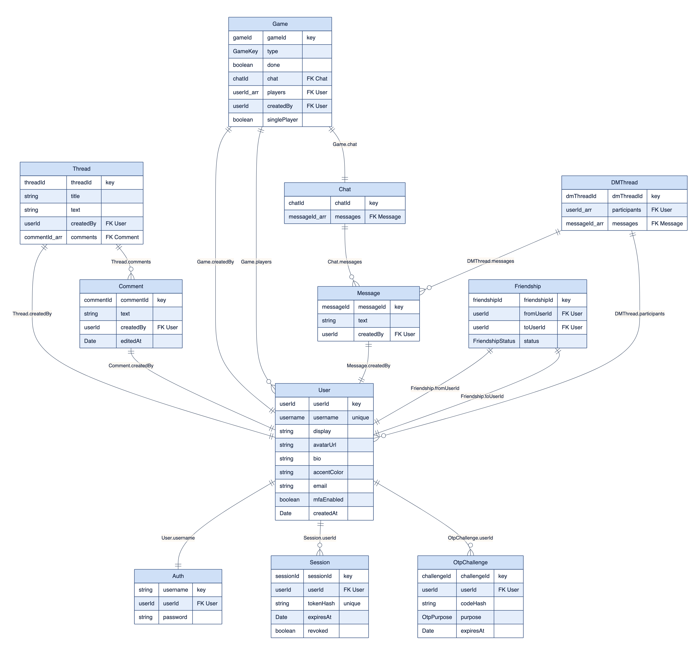
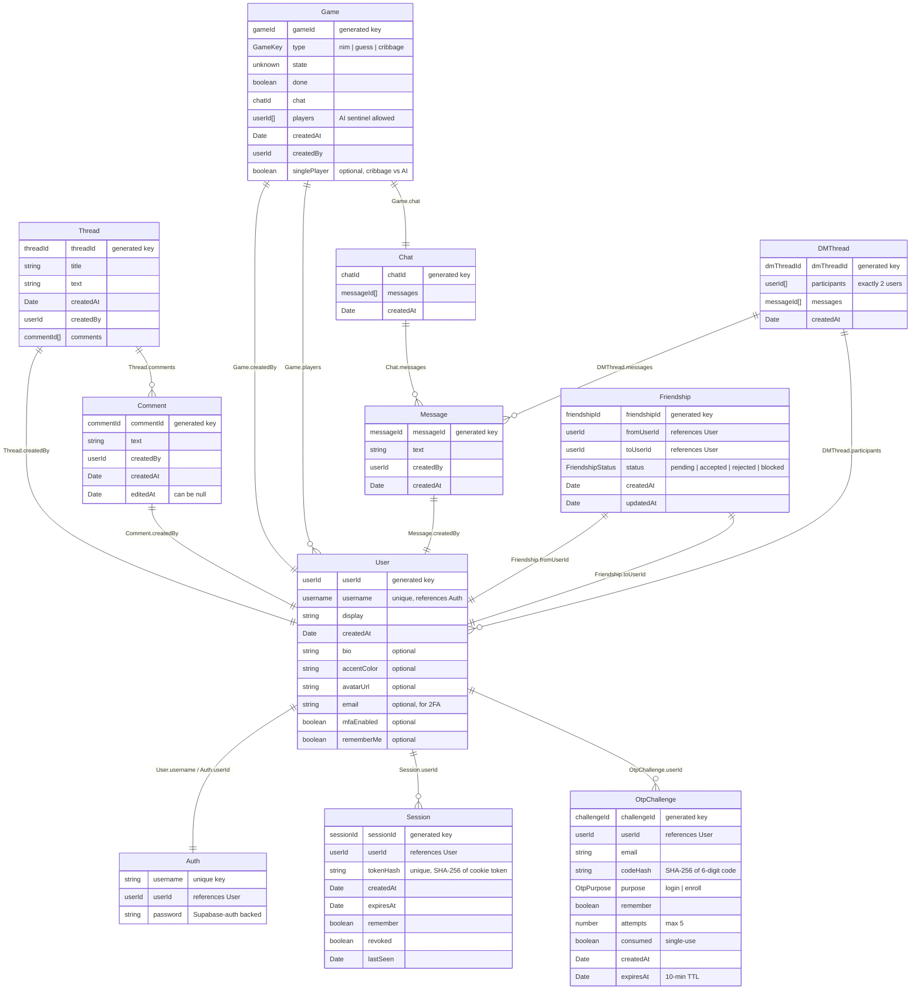
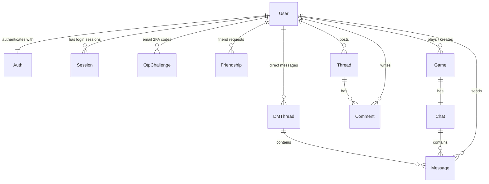

# PlayNexus — Data Architecture

PlayNexus persists all application data through a single keyv repository
abstraction backed by **Supabase Postgres** (the `playnexus_kv` store), with
**`sessions`** and **`otpChallenges`** kept in dedicated tables that have
**row-level security enabled** and are reachable only via the service-role
key. The schema centers on the **User** entity, around which four domains are
organized: identity & security, social, forum, and games.

> Crow's-foot cardinality reads `||` as _exactly one_ and `o{` as
> _zero-or-many_. "Many" relationships are stored as **id arrays on the
> parent** (a document-style key-value pattern), not as child-row foreign
> keys.

## Full data model

## High-level view (domains)

## Notes for readers

- **Document/denormalized model:** "many" links are id arrays on the parent
  (`Thread.comments`, `Chat.messages`, `Game.players`,
  `DMThread.participants`), reflecting the key-value store rather than
  normalized child-row FKs.
- **Shared `Message`:** the same `Message` entity is referenced by both game
  `Chat` and `DMThread`; it carries `createdBy` but no back-pointer to its
  container.
- **AI players:** a `Game.players` entry may be an AI sentinel id
  (single-player Cribbage), which is intentionally not a real `User` row.
- **Game invitations are not persisted** — they are delivered as real-time
  socket events, so they do not appear in the data model.
